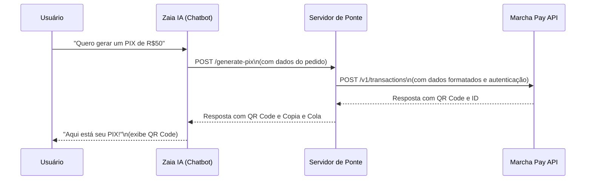

# Ponte de Integração: Zaia IA e Marcha Pay

Este projeto implementa um servidor de ponte (bridge server) que conecta o chatbot **Zaia IA** com a API de pagamentos **Marcha Pay**, permitindo que o agente de IA gere cobranças PIX de forma dinâmica e interativa durante uma conversa.

## Visão Geral

A Zaia IA, por ser uma plataforma no-code, não consegue se conectar diretamente com APIs externas que exigem autenticação complexa ou manipulação de dados. Para contornar essa limitação, este servidor atua como um intermediário seguro:

1.  **Recebe uma chamada simples** da Zaia IA com os dados da cobrança (valor, cliente, etc.).
2.  **Formata e enriquece** esses dados para o padrão exigido pela Marcha Pay.
3.  **Autentica-se de forma segura** na API da Marcha Pay usando as chaves secretas, que nunca são expostas à Zaia IA.
4.  **Cria a transação PIX** e obtém o QR Code e o código Copia e Cola.
5.  **Retorna** essas informações para a Zaia IA, que as exibe ao usuário final no chat.

### Fluxo da Integração



---

## 🚀 Começando

Siga os passos abaixo para configurar e executar o servidor de ponte.

### 1. Pré-requisitos

- **Node.js**: Versão 14 ou superior.
- **Conta na Marcha Pay**: Com chaves de API (pública e secreta) disponíveis.
- **Conta na Zaia IA**: Para configurar o agente e a ação de chamada de API.
- **Servidor para Hospedagem**: Um local para hospedar este servidor de ponte (ex: Heroku, Vercel, AWS, etc.) para que ele tenha uma URL pública acessível pela Zaia IA.

### 2. Instalação

Clone o repositório e instale as dependências:

```bash
git clone <URL_DO_REPOSITORIO>
cd zaia-marcha-bridge
npm install
```

### 3. Configuração

Crie um arquivo `.env` a partir do exemplo e preencha com suas credenciais da Marcha Pay:

```bash
cp .env.example .env
```

Edite o arquivo `.env`:

```env
# .env
MARCHA_PUBLIC_KEY=sua_chave_publica_aqui
MARCHA_SECRET_KEY=sua_chave_secreta_aqui
MARCHA_ENVIRONMENT=sandbox # ou production
PORT=3000
```

### 4. Executando o Servidor

Para iniciar o servidor em modo de desenvolvimento:

```bash
npm run dev
```

Para produção:

```bash
npm start
```

O servidor estará rodando em `http://localhost:3000`.

---

## ⚙️ Configurando a Zaia IA

Com o servidor de ponte rodando e acessível publicamente, configure a ação de chamada de API na plataforma da Zaia IA.

1.  **Acesse seu Agente na Zaia IA** e vá para o estágio onde a geração de PIX deve ocorrer.
2.  **Crie uma "Ação de Chamada de API"** com as seguintes configurações:

    -   **Nome da Ação**: `Gerar PIX com Marcha Pay`
    -   **Método (Method)**: `POST`
    -   **URL**: `https://sua-url-publica.com/generate-pix` (substitua pela URL do seu servidor de ponte).
    -   **Headers**:
        ```json
        {
          "Content-Type": "application/json"
        }
        ```
    -   **Body**:
        O corpo da requisição deve ser um JSON contendo as variáveis que seu chatbot coletou do usuário. Use as variáveis da Zaia IA (ex: `{{valor_pix}}`, `{{nome_cliente}}`).

        ```json
        {
          "amount": {{valor_pix}},
          "customer": {
            "name": "{{nome_cliente}}",
            "email": "{{email_cliente}}",
            "document": "{{documento_cliente}}"
          },
          "items": [
            {
              "name": "Cobrança via Chatbot",
              "quantity": 1,
              "price": {{valor_pix}}
            }
          ]
        }
        ```

3.  **Mapeamento da Resposta**: Configure a Zaia IA para extrair os dados da resposta da sua API (`qrCode`, `copyAndPaste`) e armazená-los em variáveis do chat.

4.  **Exibição para o Usuário**: No fluxo do chat, use as variáveis preenchidas para mostrar o QR Code e o código Copia e Cola para o usuário.

---

## 🔌 Referência da API da Ponte

### `POST /generate-pix`

Este endpoint cria uma nova transação PIX na Marcha Pay.

**Corpo da Requisição (Request Body)**

| Campo         | Tipo   | Obrigatório | Descrição                                      |
| ------------- | ------ | ----------- | ---------------------------------------------- |
| `amount`      | Number | Sim         | Valor da cobrança em formato numérico (ex: 50.00). |
| `customer`    | Object | Sim         | Objeto com os dados do cliente.                |
| `customer.name` | String | Sim         | Nome do cliente.                               |
| `customer.email`| String | Não         | E-mail do cliente.                             |
| `items`       | Array  | Sim         | Lista de itens da cobrança.                    |
| `expiresInDays` | Number | Não         | Dias para a expiração do PIX (padrão: 1).      |

**Resposta de Sucesso (Success Response)**

-   **Código**: `200 OK`
-   **Conteúdo**:
    ```json
    {
      "qrCode": "data:image/png;base64,...",
      "copyAndPaste": "00020126...",
      "transactionId": "trans_c123..."
    }
    ```

**Resposta de Erro (Error Response)**

-   **Código**: `400 Bad Request` ou `500 Internal Server Error`
-   **Conteúdo**:
    ```json
    {
      "error": "Mensagem descritiva do erro."
    }
    ```

---

## 📄 Licença

Este projeto está licenciado sob a [Licença MIT](LICENSE).
